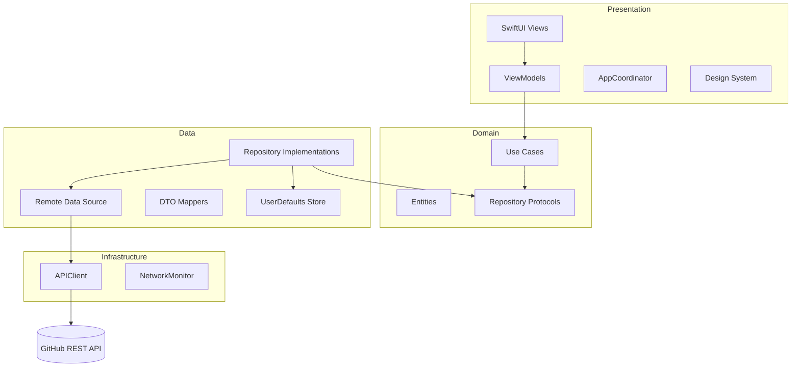

# SwiftUI Clean Architecture Demo

A production-style iOS sample app that explores **GitHub repositories** while demonstrating **Clean Architecture**, **MVVM**, and **SwiftUI** best practices.

Built as a reference project for scalable iOS apps — with clear layer separation, protocol-driven design, dependency injection, and a reusable presentation layer.

---

## Highlights

| Discover | Trending | Favorites | Settings |
|:--------:|:--------:|:---------:|:--------:|
| Search GitHub repos | Browse by topic | Save & manage favorites | App info & cache |

- **GitHub REST API** — search repositories in real time
- **Trending topics** — Swift, SwiftUI, AI, and iOS
- **Offline-aware** — network monitoring with user-facing feedback
- **Favorites** — persisted locally with UserDefaults
- **Navigation coordinator** — tab-scoped stacks, sheets, and deep-link hooks
- **Design system** — shared colors, typography, and spacing tokens
- **Accessibility** — identifiers on key UI elements for UI testing

---

<p align="center">
 
</p>

---

## Architecture

The project follows **Clean Architecture** with unidirectional data flow:

```
Presentation  →  Domain  →  Data  →  GitHub API
(Views / VM)     (Use Cases)  (Repos / DTOs)
```



### Layer responsibilities

| Layer | Role |
|-------|------|
| **Presentation** | SwiftUI views, view models, navigation, reusable UI components |
| **Domain** | Business rules, entities, use case protocols — no UI or networking |
| **Data** | Repository implementations, DTOs, mappers, remote & local data sources |
| **Infrastructure** | Networking, persistence helpers, constants, localization |
| **App** | Entry point, global state, DI container, routing |

### Key patterns

- **MVVM** — `BaseViewModel` centralizes loading, errors, and toasts via `AppState`
- **ViewState** — typed UI states: `idle`, `loading`, `loaded`, `empty`, `error`
- **Dependency Injection** — [FactoryKit](https://github.com/hmlongco/Factory) registers services in `Container+Dependencies.swift`
- **Protocol-oriented design** — every layer depends on abstractions, not concretions
- **Coordinator** — `AppCoordinator` owns per-tab `NavigationPath` and modal presentation

---

## Project structure

```
SwiftUI_CleanArchitecture_Demo/
├── App/
│   ├── DI/                    # FactoryKit dependency registration
│   ├── Main/                  # App entry point & root tab view
│   ├── Navigation/            # Routes & coordinator
│   └── State/                 # Global app state
├── Domain/
│   ├── Entities/              # RepositoryEntity, OwnerEntity
│   ├── Interfaces/            # Repository contracts
│   └── UseCases/              # Search, trending, favorites
├── Data/
│   ├── DTOs/                  # API response models
│   ├── Mappers/               # DTO → Entity mapping
│   ├── Remote/                # GitHub remote data source
│   ├── Local/                 # Favorites local data source
│   └── Repositories/          # Repository implementations
├── Presentation/
│   ├── Common/                # Components, design system, extensions
│   └── Features/              # Discover, Favorites, Trending, Settings
└── Infrastructure/
    ├── Constants/
    ├── Localization/
    ├── Network/               # APIClient & error handling
    ├── Persistence/           # UserDefaults wrapper
    ├── Resources/             # Assets & colors
    └── Utilities/             # NetworkMonitor
```

---

## Tech stack

- **SwiftUI** & **Combine**
- **Swift Concurrency** (`async`/`await`)
- **FactoryKit** — lightweight dependency injection
- **URLSession** — HTTP networking (no third-party network layer)
- **UserDefaults** — favorites persistence
- **[GitHub REST API](https://docs.github.com/en/rest)** — repository search

---

## Requirements

- Xcode 15+
- iOS 16+
- Internet connection (GitHub API)

---

## Getting started

### 1. Clone the repository

```bash
git clone https://github.com/MianMHaroon/SwiftUI_CleanArchitecture_Demo.git
cd SwiftUI_CleanArchitecture_Demo
```

### 2. Open in Xcode

Open `SwiftUI_CleanArchitecture_Demo.xcodeproj` (or `.xcworkspace` if you use one).

### 3. Resolve dependencies

If prompted, allow Xcode to resolve Swift Package Manager dependencies (FactoryKit).

### 4. Run

Select an iPhone simulator and press **⌘R**.

> **Note:** No API key is required for basic GitHub search. Unauthenticated requests are subject to [GitHub rate limits](https://docs.github.com/en/rest/using-the-rest-api/rate-limits-for-the-rest-api).

---

## Features in detail

### Discover
Search public GitHub repositories. Results open a detail screen with stars, forks, language, owner info, and a favorite action.

### Trending
Curated topic sections (Swift, SwiftUI, AI, iOS) load top search results per topic.

### Favorites
Star repositories from the detail screen. Manage saved items locally; clear the cache from Settings.

### Settings
View app version, network status, link to GitHub API docs, and clear favorites cache.

---

## Testing & quality

The codebase includes `accessibilityIdentifier`s on primary screens and controls to support UI tests. Extend with unit tests for use cases and repository mocks as needed.

---

## Roadmap ideas

- [ ] Unit & UI test targets
- [ ] GitHub authentication for higher rate limits
- [ ] Pagination for search results
- [ ] Dark mode theme switching
- [ ] SwiftData or Core Data migration for favorites

---

## Author

**Muhammad Haroon**

- Email: [mianmharoon72@gmail.com](mailto:mianmharoon72@gmail.com)
- LinkedIn: [linkedin.com/in/mian-haroon](https://www.linkedin.com/in/mian-haroon)

---

## License

This project is licensed under the **MIT License** — see the [LICENSE](LICENSE) file for details.

---

## Acknowledgments

- [GitHub REST API](https://docs.github.com/en/rest)
- [FactoryKit](https://github.com/hmlongco/Factory) by Michael Long

---
